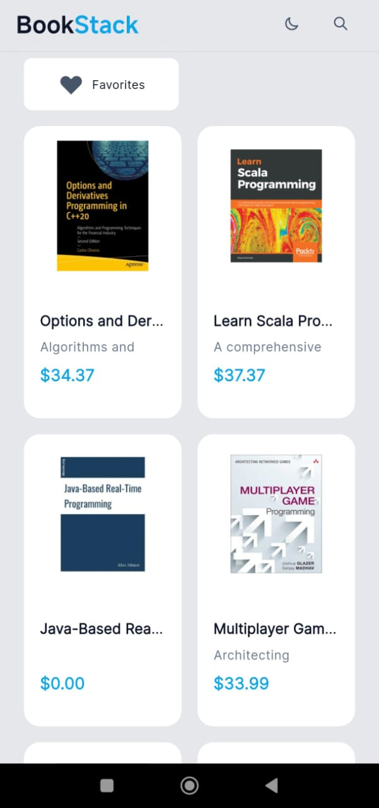
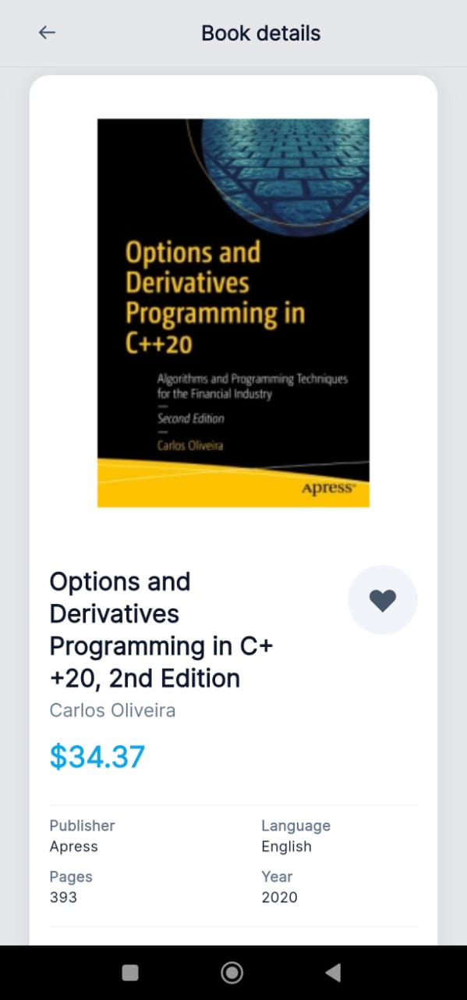
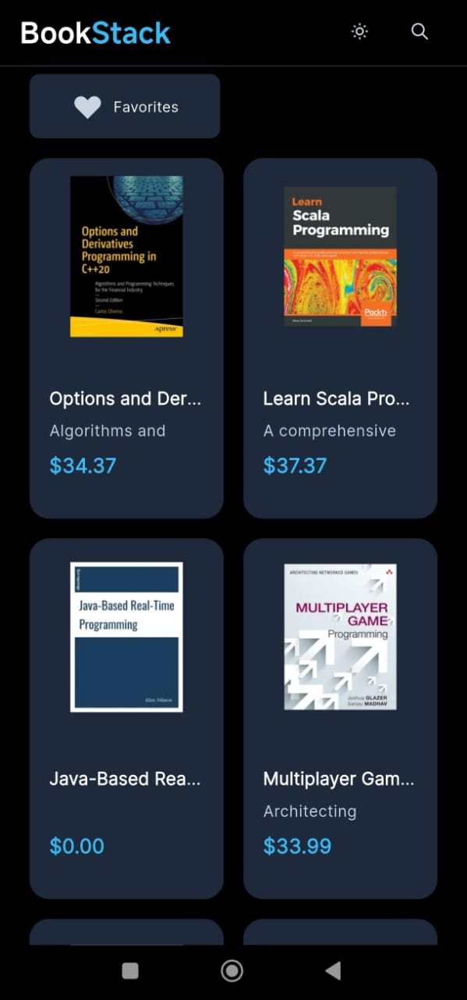
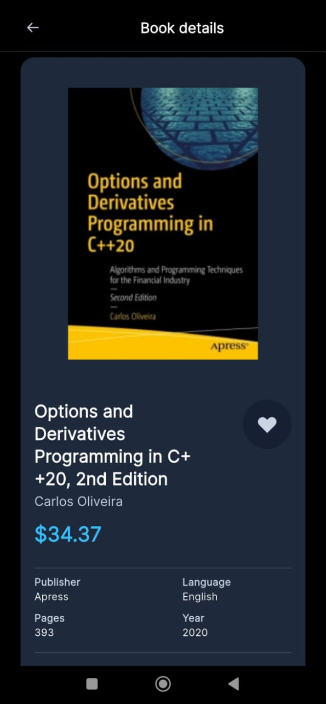
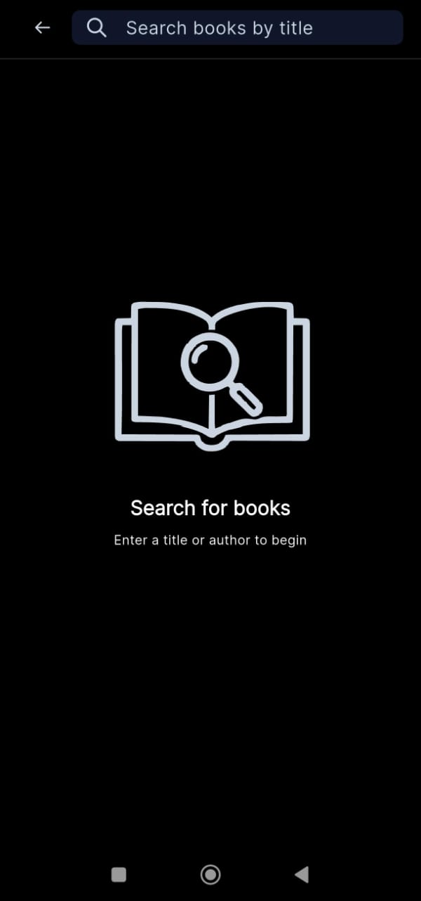

# book_stack

Flutter application to explore and search for books, with support for light and dark modes.

## Preview

| Light Mode Home | Light Mode Book Detail | Light Mode Search |
|-----------------|-----------------------|-------------------|
|  |  |  |

| Dark Mode Home | Dark Mode Book Detail | Dark Mode Search |
|----------------|----------------------|------------------|
|  |  |  |


## Description

**book_stack** is a mobile application built with Flutter that allows users to search, explore, and view book details using the [IT Book Store public API](https://api.itbook.store/#api-search). Users can mark books as favorites, view enriched details, and enjoy a modern visual experience with support for both light and dark themes.

## API Used

The app consumes the [IT Book Store REST API](https://api.itbook.store/#api-search), which provides endpoints for searching books, viewing new releases, and accessing detailed information for each book. Example endpoints used:

- Search books: `https://api.itbook.store/1.0/search/{query}/{page}`
- New books: `https://api.itbook.store/1.0/new`
- Book details: `https://api.itbook.store/1.0/books/{isbn13}`

## Project Structure

```
lib/
  config/           # Configuration, services, and routes
  domain/           # Entities, repositories, and use cases (Clean Architecture)
  infraestructure/  # Implementations, models, and data sources
  presentation/     # Screens, providers, and widgets
  assets/           # Images, icons, and static resources
```

- **Clean Architecture:** Clear separation between domain, infrastructure, and presentation layers.
- **Atomic Design:** Uses the [book_stack_design_system](https://github.com/jlamilla/book_stack_design_system) library for reusable and scalable components.
- **Best Practices:** Modular code, Riverpod for state management, error handling, and strict typing.

## Best Practices & Clean Code

- **Clear and consistent naming** for classes, methods, and variables.
- **Reactive state management** with Riverpod.
- **Centralized error handling** using Failure and Exception classes.
- **Separation of concerns** following Clean Architecture.
- **Componentization** with Atomic Design for UI.
- **Linting and static analysis** (see `analysis_options.yaml`).

## Installation & Running

### Prerequisites

- [Flutter 3.35.2](https://docs.flutter.dev/get-started/install)
- [Dart 3.9.0](https://dart.dev/get-dart)
- Android SDK >= 36.0.0
- [Android Studio](https://developer.android.com/studio) or [VS Code](https://code.visualstudio.com/)
- [book_stack_design_system](https://github.com/jlamilla/book_stack_design_system) as a local dependency

### Debugging Steps

1. **Clone the repository:**
   ```sh
   git clone https://github.com/your_user/book_stack.git
   cd book_stack
   ```

2. **Install dependencies:**
   ```sh
   flutter pub get
   ```

3. **Set up the design system library:**
   - Clone [book_stack_design_system](https://github.com/jlamilla/book_stack_design_system) in the same workspace.
   - Make sure the path in `pubspec.yaml` is correct:
     ```yaml
     book_stack_design_system:
       path: ../book_stack_design_system
     ```

4. **Check your environment:**
   ```sh
   flutter doctor -v
   ```
   > Make sure you have Flutter 3.35.2, Dart 3.9.0, Android SDK 36.0.0, and VS Code or Android Studio installed.

5. **Run the application:**
   ```sh
   flutter run
   ```
   You can select your preferred device (Android emulator etc.).

6. **Troubleshooting:**
   - If you see `Some Android licenses not accepted`, run:
     ```sh
     flutter doctor --android-licenses
     ```
   - If you have issues with the design system library, check the path and dependencies.

## Useful Resources

- [Flutter Documentation](https://docs.flutter.dev/)
- [IT Book Store API](https://api.itbook.store/)
- [book_stack_design_system](https://github.com/jlamilla/book_stack_design_system)

---

Contributions and suggestions are welcome!
